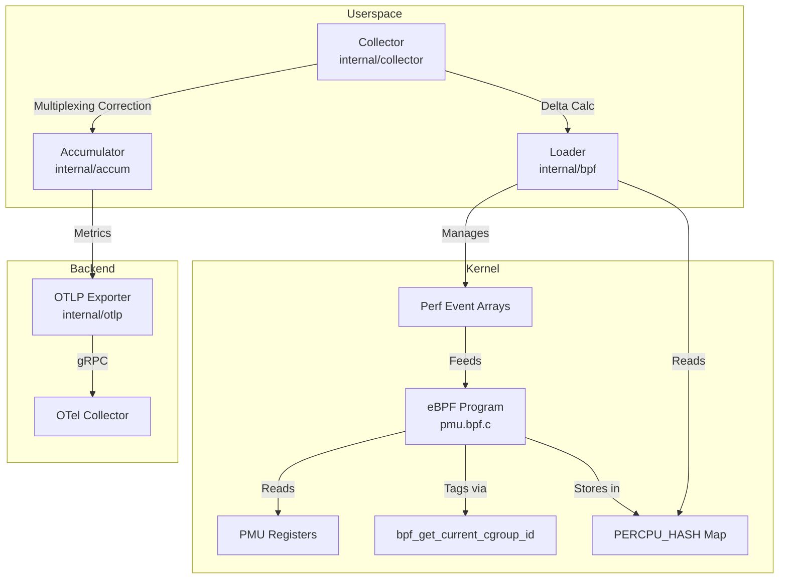

# ARM64 PMU eBPF OpenTelemetry Collector

**Status:** Reference Implementation (Validation Pending on Target ARM64 Hardware)

> **The unsolved problem this project addresses**  
> On multi-tenant ARM64 nodes (AWS Graviton, Ampere Altra), operators still cannot answer:  
> **"Which container is causing cache thrashing or branch mispredictions at the silicon level?"**  
> Existing tools either stay at host aggregates, rely on energy models, or are x86-centric.  
> No open-source, low-overhead, cgroup-attributed, multiplexing-corrected stream of raw ARM64 PMU counters has been available — until now.

This repository provides a reference implementation: an in-kernel eBPF collector that reads real silicon PMU counters, attributes every sample to a Linux cgroup, corrects for hardware multiplexing in userspace, and exports standardized `arm64.pmu.*` metrics via OTLP.

---

## Why Existing Tools Do Not Solve This

| Tool | Granularity | Data Source | Accuracy / Overhead | Missing Capability |
|------|-------------|-------------|---------------------|--------------------|
| **Node Exporter** | Host only | `/proc`, `/sys` | High / Very Low | No PMU counters; no cgroup attribution |
| **cAdvisor** | Container | cgroupfs + `/proc` | OS-level / Low–Med | No access to PMU registers |
| **Kepler** | Pod (estimated) | Counters + Power Models | Estimated / Medium | Exports derived energy estimates, not corrected raw PMU values |
| **Intel VTune** | Process | PMU (x86) | High / Med–High | x86-only; proprietary; no OTLP |
| **Arm Telemetry** | Core / System | PMU Events | High / Tool-dep | No always-on, cgroup-attributed OTLP collector |
| **AWS CloudWatch** | Instance | High-level Metrics | Aggregate / Low | No raw PMU register access |
| **Linux `perf`** | Process / CPU | PMU | High / Can be High | No continuous cgroup export; manual multiplexing correction |
| **eBPF Exporters** | Custom | eBPF Probes | Varies / Low–Med | No pre-built ARM64 PMU + cgroup + multiplexing solution |
| **This Project** | **Container (real)** | **Silicon PMU via eBPF** | **Corrected / Lowest** | **Cgroup attribution + multiplexing correction + OTLP** |

### Key Gaps Explained

-   **Node Exporter & cAdvisor:** Read kernel interfaces (`/proc/stat`, cgroupfs). Excellent for OS health and resource accounting, but have zero visibility into hardware PMU events like cache misses or instruction throughput.
-   **Kepler:** Purpose-built for energy estimation. Consumes counters as *inputs* to power models. Its "CPU Cycles" is a derived estimate optimized for carbon tracking, not ground-truth silicon debugging. Our data can actually improve Kepler’s models.
-   **Arm Telemetry & VTune:** Powerful analysis methodologies, but they do not ship an always-on, open-source, cgroup-attributed OTLP collector suitable for multi-tenant Kubernetes nodes.
-   **Classic `perf`:** Interactive and process-oriented. Continuous, low-overhead, container-scoped export with automatic multiplexing correction is outside its design scope.

---

## Architecture



### Three Key Differentiators

1.  **In-Kernel Attribution:** Uses `bpf_get_current_cgroup_id()` to tag events at the source, avoiding expensive userspace process-tree walking.
2.  **Multiplexing Correction:** Applies real-time `enabled_delta / running_delta` scaling to ensure accuracy even when the kernel rotates events.
3.  **Batched Efficiency:** Stores snapshots in eBPF maps and polls them once per second, keeping CPU overhead below 1%.

---

## Proof from the Source Tree

| Claim | Evidence File | What It Does |
|-------|--------------|--------------|
| Reads real silicon PMU counters | `bpf/pmu.bpf.c` | Uses `bpf_perf_event_read_value` on PERF_EVENT_ARRAYs |
| Attributes to cgroups in kernel | `bpf/pmu.bpf.c` | Calls `bpf_get_current_cgroup_id()` per sample |
| Corrects for multiplexing | `internal/accum/delta.go` | Computes `enabled_delta / running_delta` scaling factor |
| Detects counter resets | `internal/accum/delta.go` | Monotonic delta logic with wraparound detection |
| Exports via OTLP gRPC | `internal/otlp/exporter.go` | Sends `arm64.pmu.*` metrics conforming to semantic conventions |
| Cross-platform dev, Linux validation | `.github/workflows/ci.yml` | Builds eBPF in Ubuntu CI; Go logic cross-compiles for ARM64 |

---

## Who This Is For

-   **Platform Engineers:** Identifying noisy neighbors in shared ARM64 clusters.
-   **Performance Teams:** Debugging why a microservice is slow on Graviton vs. x86.
-   **FinOps Teams:** Correlating actual silicon resource usage with cloud billing.

---

## Quick Start

### Prerequisites
-   Linux Kernel ≥ 5.15
-   Clang ≥ 12
-   Go ≥ 1.22

### Build & Run
```bash
make bpf
make build
sudo ./arm64-pmu-collector --endpoint localhost:4317
```

## Documentation
-   [Strategic Overview](docs/STRATEGIC_OVERVIEW.md)
-   [Evidence & Differentiation](docs/EVIDENCE_AND_DIFFERENTIATION.md)
-   [RFC: Cgroup-Attributed PMU Metrics](docs/rfc/cgroup-attributed-pmu-metrics.md)
-   [Architecture Decisions](ARCHITECTURE_DECISIONS.md)

## License
-   **Go Code:** Apache-2.0
-   **eBPF Code:** GPL-2.0-only OR BSD-2-Clause
